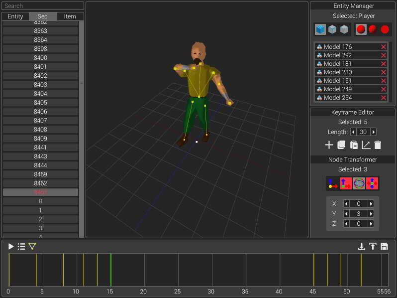

# poser-gl
 

An OpenGL animation editor for [RuneScape](https://www.runescape.com/)

## Setup
- Clone the repository
- Build `app` and `api` Maven modules
- Create a plugin targeting your desired revision which conforms to the API
- JAR your plugin and place in a top-level `plugin` directory
- Run the application, selecting your plugin and a compatible cache
